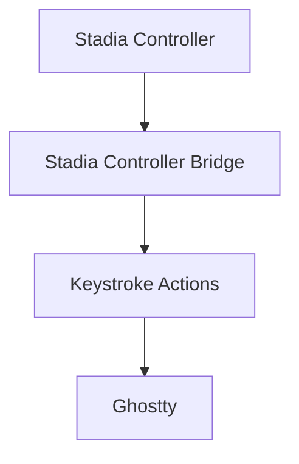
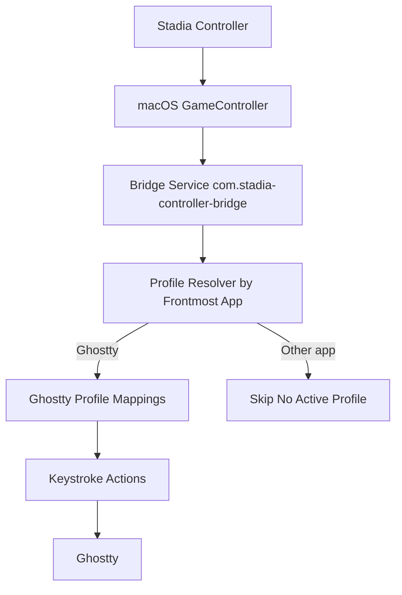

# Stadia macOS Controller Bridge

## What This Does (Simple)
- Reads Stadia controller input on macOS.
- Runs a local bridge service.
- Converts mapped button presses into keystroke actions.
- Sends those actions to Ghostty.

## Simple Flow (Mermaid)


## Simple Flow (ASCII)
```text
┌──────────────────────────┐
│                          │
│    Stadia Controller     │
│                          │
└─────────────┬────────────┘
              │
              ▼
┌──────────────────────────┐
│                          │
│ Stadia Controller Bridge │
│                          │
└─────────────┬────────────┘
              │
              ▼
┌──────────────────────────┐
│                          │
│    Keystroke Actions     │
│                          │
└─────────────┬────────────┘
              │
              ▼
┌──────────────────────────┐
│                          │
│         Ghostty          │
│                          │
└──────────────────────────┘
```

## Profile-Aware Flow (Mermaid)


## Profile-Aware Flow (ASCII)
```text
Stadia Controller
  |
  v
macOS GameController
  |
  v
Bridge Service (com.stadia-controller-bridge)
  |
  v
Profile Resolver (frontmost app)
  | Ghostty                    | Other app
  v                            v
Ghostty Profile Mappings     Skip No Active Profile
  |
  v
Keystroke Actions
  |
  v
Ghostty
```
