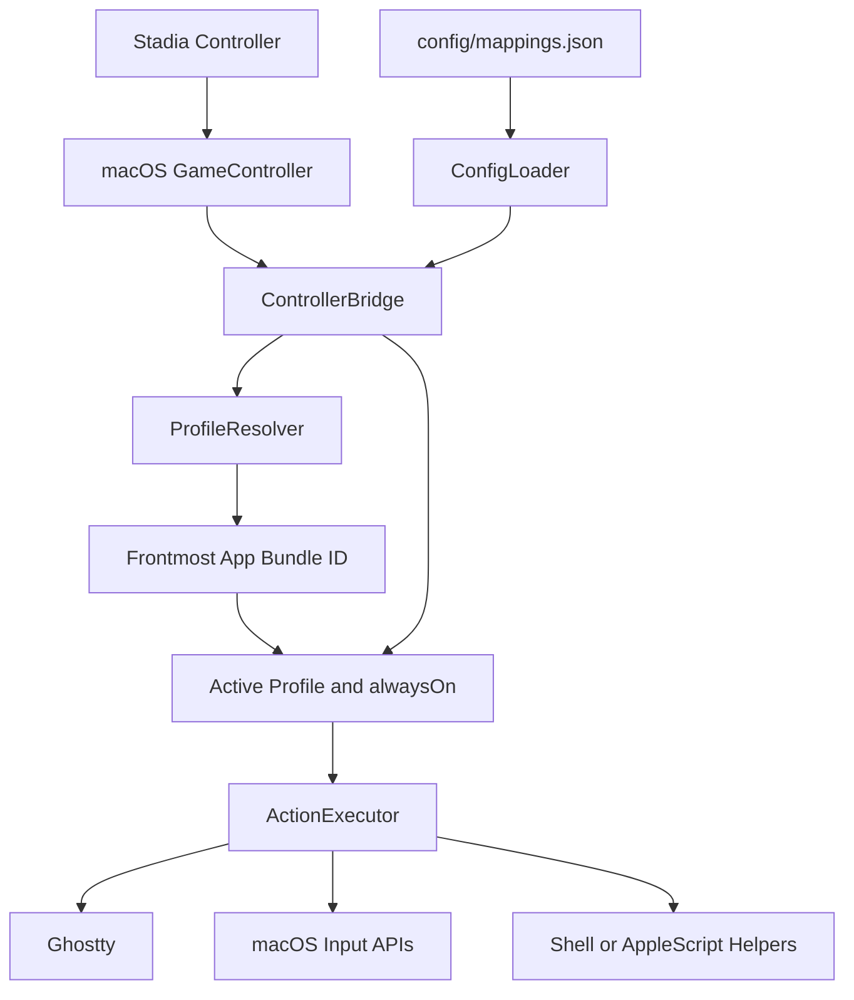

# Bridge Overview

This repo is a small local input bridge. The Stadia controller is the input device, `ControllerBridge` owns runtime orchestration, `ProfileResolver` chooses the active app profile, and `ActionExecutor` dispatches the mapped action to Ghostty or macOS. The bridge does not try to be a full automation platform. It loads config, watches for changes, resolves the frontmost app, and executes the smallest thing needed.

## Main Parts

- `GameController` gives the raw controller buttons and stick values.
- `ConfigLoader` validates `config/mappings.json` on startup and on hot reload before the runtime adopts new settings.
- `ControllerBridge` polls inputs, tracks debounce and hold state, watches the config file, and coordinates profile resolution plus action dispatch.
- `ProfileResolver` maps the frontmost macOS bundle ID to one configured profile name.
- `config/mappings.json` is the source of truth for app profiles, `alwaysOn` controls, button mappings, analog behavior, and safety defaults.
- `ActionExecutor` dispatches the chosen action through macOS input APIs, shell helpers, or Ghostty's AppleScript surface.
- Ghostty-specific actions can go through three paths:
  - plain keystrokes
  - Ghostty native action dispatch
  - Ghostty AppleScript surface creation for richer tab startup behavior

## Main Flow

1. Parse CLI options and load `config/mappings.json`.
2. Start controller discovery, polling, and config-file watching.
3. Detect button or stick changes and normalize them into runtime events.
4. Resolve the frontmost app bundle ID and choose the matching profile, plus any explicit `alwaysOn` controls.
5. Execute the mapped action through `ActionExecutor`.

## Action Types

- `keystroke` / `modifierChord` / `holdKeystroke`
  - generic macOS key injection
  - `modifierChord` sends real modifier key down/up events around the keystroke for app switchers that commit on modifier release
- `ghosttyAction`
  - Ghostty-native terminal action such as `next_tab`, `goto_split:next`, or `close_surface`
- `applescript`
  - richer Ghostty control for cases where a plain action is not enough, such as opening a new tab with custom startup behavior
- `text`, `shell`, `mouseClick`
  - utility paths for Codex-specific prompts and a few non-terminal actions

## Boundaries

- The bridge repo owns controller mapping, profile resolution, action dispatch, and config validation.
- Ghostty owns terminal/tab/split semantics.
- Machine-level install and launchd wiring live in `~/GitHub/scripts/setup/stadia/`.
- Codex shell behavior and the directory picker live in `~/.agents/codex/`.

## Notes

- Config-only mapping changes hot-reload.
- Runtime/schema changes do not hot-reload into the staged launchd app; they require reinstalling the launchd service so the staged binary is rebuilt.
- Ghostty AppleScript is currently a preview API in Ghostty `1.3.x`, but this repo uses it intentionally because it is the cleanest way to express tab-level startup behavior.
