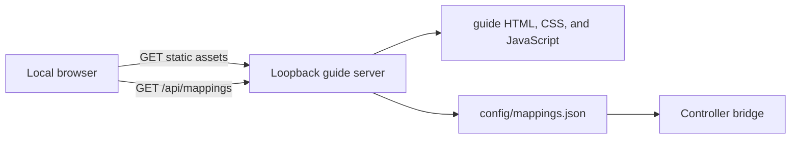

# Controller Guide

The Controller Guide is a read-only local web surface for understanding the
bridge configuration. It is deliberately separate from the bridge runtime: the
guide never receives controller events and cannot execute or edit actions.

## Runtime shape

- `scripts/run-controller-guide.sh` starts a Python standard-library HTTP server
  on `127.0.0.1:8173` and opens the default browser.
- Production uses a dedicated LaunchAgent on `127.0.0.1:8798`. The shared
  Mac mini Cloudflare Tunnel routes `controller.adithyan.io` to that loopback
  service; Cloudflare Access authenticates the browser before traffic reaches
  the guide.
- `scripts/serve-controller-guide.py` serves an explicit allowlist of guide
  assets and exposes the live config at `/api/mappings`.
- The server does not expose the repository as a static directory.
- `guide/app.js` resolves effective button mappings the same way as the bridge:
  an enabled application-profile mapping wins over the same `alwaysOn` button.
- For supported analog modes, `alwaysOn` configuration wins when present;
  otherwise the enabled profile configuration is shown.

## Boundaries

- `config/mappings.json` remains the only mapping source of truth.
- Controller names, physical positions, and the Codex browser-focus operational
  note are presentation metadata, not duplicated action configuration.
- The guide is read-only. Mapping edits continue to happen in the JSON file.
- The server binds to loopback by default and uses a restrictive content security
  policy. It has no package dependencies, remote fonts, analytics, or telemetry.
- The public hostname is private-by-authentication: it is reachable on the
  internet only through the Adithyan-only Cloudflare Access application. Do not
  remove that policy because the guide exposes exact local automation mappings.

## Failure behavior

- Invalid or unreadable JSON returns a structured `500` response and produces an
  actionable error state in the page.
- Unknown routes return `404`; they cannot be used to browse other repo files.
- Refreshing the page or pressing Refresh rereads the JSON, so mapping changes do
  not require rebuilding the guide.
