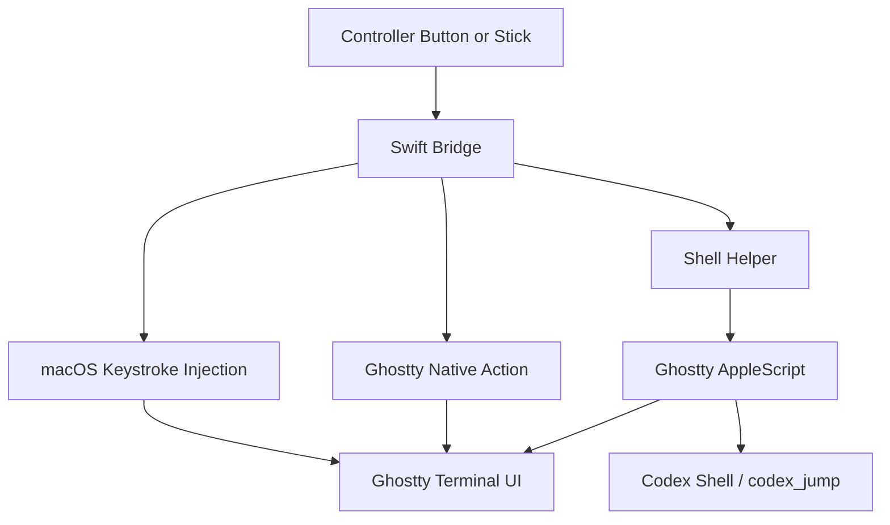

# Ghostty Integration

Ghostty is the main target app for this bridge. The important design choice is that the bridge now prefers Ghostty's own semantics whenever Ghostty has a first-class way to express the behavior. That keeps controller mappings aligned with what Ghostty means by tabs, splits, and focused surfaces.

## Current Strategy

- Use `ghosttyAction` when Ghostty already has a first-class terminal action.
- Use a shell helper plus Ghostty AppleScript when a controller action should trigger richer tab startup behavior.
- Keep plain keystrokes only for actions that are really just terminal input, not Ghostty structure.

## Current Mappings

`config/mappings.json` is the source of truth for the current button layout, keycodes, helper commands, and descriptions. Do not duplicate the live mapping table here; update the config descriptions instead.

The stable integration roles are:
- `ghosttyAction` for simple Ghostty terminal structure actions.
- Shell helpers for richer Codex/Ghostty surface startup flows.
- Plain keystrokes or text actions for terminal input.
- Ghostty-targeted scroll for focused-terminal scrolling when Ghostty is frontmost.

## Why AppleScript Is Acceptable Here

Ghostty `1.3.x` exposes a preview AppleScript API on macOS. This repo intentionally builds on top of that API for the new-tab flow because Ghostty's first-class actions are not enough for "open a new tab, disable normal autostart in that tab, and immediately run the repo picker." That is a real tab-construction problem, not just a shortcut problem.

The tradeoff is acceptable here because:

- the behavior works in live use
- it is narrow in scope
- the bridge keeps simple actions on Ghostty-native actions instead of moving everything to AppleScript
- for scroll behavior, targeting Ghostty's focused terminal is more robust than trying to move the OS cursor to split-specific screen coordinates that Ghostty does not expose

## Operational Note

- Config-only Ghostty mapping changes can hot-reload.
- Any change that adds a new runtime action type or config shape requires reinstalling the staged launchd app:
  - `~/GitHub/scripts/setup/stadia/install-launchd-stadia-controller-bridge.sh --mode live`

## Related Docs

- `docs/architecture/bridge-overview.md`
- `docs/references/setup.md`
- `docs/references/mappings-schema.md`
- `docs/references/ghostty-mapping-rationale.md`
